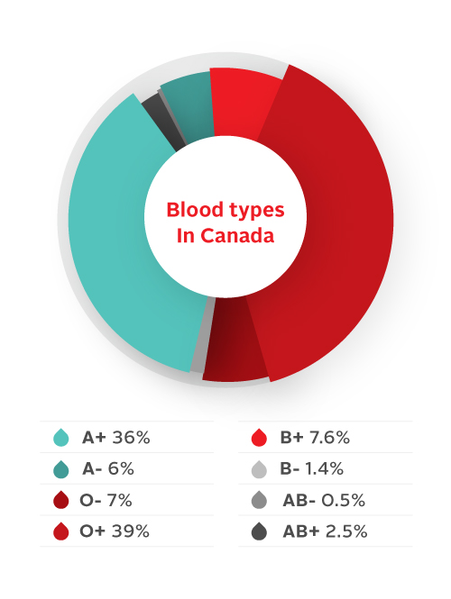

# Joint Probability

Blood plays a role in many forensic science applications, with the "blood
type" determined by a combination of two different blood group systems:

> *Blood types are inherited and represent contributions from both parents. 
> As of 2019, a total of 41 human blood group systems are recognized by the 
> International Society of Blood Transfusion (ISBT). The two most 
> important blood group systems are ABO and Rh; they determine someone's 
> blood type (A, B, AB, and O, with +, − or null denoting RhD status) 
> for suitability in blood transfusion.*
>
> Source: https://en.wikipedia.org/wiki/Blood_type

Suppose that we have a collection of 1000 people, each classified by Rh 
(Rh+ or Rh-) and ABO (A, B, AB, or O). 
The number of people of each combination of Rh and ABO grouping is shown 
in the table below.

$$
\begin{array}{c|c|c}
\mbox{ABO\Rh}        & \mathrm{Rh+} & \mathrm{Rh-}\\ \hline
\mathrm{A} & 360 & 60 \\ 
\mathrm{B} & 76 & 14 \\ 
\mathrm{AB} & 25 & 5 \\ 
\mathrm{O} & 390 & 70 \\ 
\end{array}\\
\mbox{Rh and ABO counts}
$$

Suppose that we select one of the people at random, and note that person's groups. 
There are various possibilities for outcomes, such as the person selected is Rh+ and O. 
The likelihood that this combination occurs is the **joint probability** of the two classifications,
Rh and ABO grouping.
As 390 out of the 1000 people are O+, the probability of selecting such a person is

$$\mbox{P(O+)} = \frac{390}{1000} = 0.39$$

Here, P(O+) stands for the probability that the person selected is Rh+ **and** type O. 
A sample of other probabilities that come directly from the table are

$$\begin{array}{rcccl}
\mbox{P(Female and Type O)} & = & {\displaystyle\frac{202}{1000}} & = & 0.202 \\[5pt]
\mbox{P(Male and Type AB)} & = & {\displaystyle\frac{24}{1000}} & = & 0.024 \\[5pt]
\mbox{P(Male and Type A)} & = & {\displaystyle\frac{235}{1000}} & = & 0.235 \\
\end{array}$$

We also can combine table entries to compute other probabilities. 
For instance, there are a total of $16 + 24 = 40$ people with blood type AB, so

$$
\mbox{P(Type AB)} = \frac{40}{1000} = 0.04
$$

For another example, there are a total of $235 + 24 + 63 + 248 = 570$ males in our population, so

$$
\mbox{P(Male)} = \frac{570}{1000} = 0.57
$$

### Sample Questions

**1.** What is the probability that the person selected is female?

**Answer:** <hide>$P(\text{Female}) = 1 - P(\text{Male}) = 1 - 0.57 = 0.43$ This is equivalent to $(175 + 16 + 37 + 202) / 1000$.<hide>

**2.** What is the probability that the person selected is male and has type A blood and type O blood?

**Answer:** <hide>$P(\text{Male and A and O}) = 0$. 
The probability of this event occurring in the table is zero, as no men have two different types of blood. <hide>

## And vs Or

Above we saw that $\mbox{P(Female and Type A)} = 0.175$. Suppose we instead would like to know $\mbox{P(Female or Type A)}$? 
That is, we want to know the probability that a randomly selected person is either female or has type A blood. 
(Note that this group includes those who are both female **and** have type A blood.) 
From our table we see that the total number in this group is $175 + 16 + 37 + 202 + 235 = 665$ so that

$$
\mbox{P(Female or Type A)} = \frac{665}{1000} = 0.665
$$

Other combinations are also possible. 
For instance, there are $175 + 235 = 310$ people with type A blood and $37 + 63 = 100$ people with type B blood, 
so there are a total of $310 + 100 = 410$ people that have either type A or type B blood. 
Therefore, we have

$$
\mbox{P(Type A or Type B)} = \frac{410}{1000} = 0.41
$$

### Sample Questions

**1.** What is the probability of selecting a female or male with type AB blood?

**Answer:** <hide>$P(\text{(Male or Female) and AB}) = P(\text{(Male and AB) or (Female and AB)}) = (16 + 24) / 1000 = 0.04$<hide>

## Probability Tables

Frequently, tables provide probabilities (or percentages) instead of counts. 
To make the conversion from counts to probabilities, all we do is divide each table entry by the total. 
Thus, for our table, we divide each entry by 1000 to arrive at

$$
\begin{array}{c|c|c}
           & \mathrm{F} & \mathrm{M}\\ \hline
\mathrm{A} & 0.175 & 0.235 \\ 
\mathrm{AB} & 0.016 & 0.024 \\ 
\mathrm{B} & 0.037 & 0.063 \\ 
\mathrm{O} & 0.202 & 0.248 \\ 
\end{array}\\
\mbox{Gender and blood type counts}
$$

Table 2 entries give the probability of selecting each combination. For instance

$$
\mbox{P(Female and Type O)} = 0.202
$$

We can add entries in this table to compute other probabilities.  
For example, suppose we want to compute the probability that a randomly selected person has type O blood. 
Based on the table, this can happen if a person is female and has type O blood, or if a person is male and has type O blood. 
Because these two groups are disjoint, we can add the probabilities to arrive at

$$
\mbox{P(Type O)} = \mbox{P(Female and Type O)} + \mbox{P(Male and Type O)}
= 0.202 + 0.248 = 0.45
$$

If instead (for instance), we want to compute P(Female) then we add the entries in the corresponding column, giving us

$$
\mbox{Pr(Female)} = 0.175 + 0.016 + 0.037 + 0.202 = 0.43 
$$
